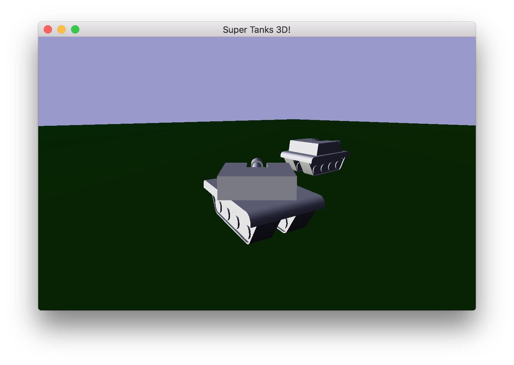

# SUPER TANKS 3D!!!1 (beta)

Title: Super Tanks 3D

Author: Adrian Biagioli

Design Document: [Super Tanks](http://graphics.cs.cmu.edu/courses/15-466-f18/game2-designs/ajaiswal/)

Screen Shot:



How To Play:

Launch the server executable with 

    $ ./server <port>

Launch the client executable with

    $ ./client <server> <port>


Use WSAD to move and Q/E to aim.  The guns are broken at the moment, so you will have to find out some other
way to have fun.

Changes From The Design Document:

I (tried) to make it 3D!  At the very least, the two tanks control quite well and network together.

Good / Bad / Ugly Code:

I'm quite proud of the work that I did on the Tank controls and networking for the tanks specifically.
I worked on a modification to the scene loader that allows for empty blender objects.  This made it way
easier to support the complex geometry of the tanks and made the math more elegant.

The networking code is a bit hacky (it uses TCP after all) and I had quite a bit of trouble dealing with
getting combat working.  I actually thought that the 3D aspect of this project would be the most challenging
part -- I now realize that getting combat working was!

The original plan was to have positional movement like now, but in addition to that the players could shoot
at each other and engage in combat.  If I had unlimited time, I would use a dynamic heightmap that could
morph when shot at.  This is also a pretty elegant way to get around walkmeshes, as it is much easier to
piece together a movement algorithm around a heightmap than with barycentric coordinates.  But alas, I had
no time.

I also wanted to animate the Tanks better -- a simple tiling UV map for the treads on the wheels that
scrolled as the player moves would have gone a long way.  However due to the TOC I only had around 15 hours
to put into this project, and much of that was spent on networking.

# Using This Base Code

Before you dive into the code, it helps to understand the overall structure of this repository.
- Files you should read and/or edit:
    - ```main.cpp``` creates the game window and contains the main loop. You should read through this file to understand what it's doing, but you shouldn't need to change things (other than window title, size, and maybe the initial Mode).
    - ```server.cpp``` creates a basic server.
    - ```GameMode.*pp``` declaration+definition for the GameMode, a basic scene-based game mode.
    - ```meshes/export-meshes.py``` exports meshes from a .blend file into a format usable by our game runtime.
    - ```meshes/export-walkmeshes.py``` exports meshes from a given layer of a .blend file into a format usable by the WalkMeshes loading code.
    - ```meshes/export-scene.py``` exports the transform hierarchy of a blender scene to a file.
	- ```Connection.*pp``` networking code.
    - ```Jamfile``` responsible for telling FTJam how to build the project. If you add any additional .cpp files or want to change the name of your runtime executable you will need to modify this.
    - ```.gitignore``` ignores the ```objs/``` directory and the generated executable file. You will need to change it if your executable name changes. (If you find yourself changing it to ignore, e.g., your editor's swap files you should probably, instead be investigating making this change in the global git configuration.)
- Files you should read the header for (and use):
	- ```Sound.*pp``` spatial sound code.
    - ```WalkMesh.*pp``` code to load and walk on walkmeshes.
    - ```MenuMode.hpp``` presents a menu with configurable choices. Can optionally display another mode in the background.
    - ```Scene.hpp``` scene graph implementation, including loading code.
    - ```Mode.hpp``` base class for modes (things that recieve events and draw).
    - ```Load.hpp``` asset loading system. Very useful for OpenGL assets.
    - ```MeshBuffer.hpp``` code to load mesh data in a variety of formats (and create vertex array objects to bind it to program attributes).
    - ```data_path.hpp``` contains a helper function that allows you to specify paths relative to the executable (instead of the current working directory). Very useful when loading assets.
    - ```draw_text.hpp``` draws text (limited to capital letters + *) to the screen.
    - ```compile_program.hpp``` compiles OpenGL shader programs.
    - ```load_save_png.hpp``` load and save PNG images.
- Files you probably don't need to read or edit:
    - ```GL.hpp``` includes OpenGL prototypes without the namespace pollution of (e.g.) SDL's OpenGL header. It makes use of ```glcorearb.h``` and ```gl_shims.*pp``` to make this happen.
    - ```make-gl-shims.py``` does what it says on the tin. Included in case you are curious. You won't need to run it.
    - ```read_chunk.hpp``` contains a function that reads a vector of structures prefixed by a magic number. It's surprising how many simple file formats you can create that only require such a function to access.

## Asset Build Instructions

The ```meshes/export-meshes.py``` script can write mesh data including a variety of attributes (e.g., *p*ositions, *n*ormals, *c*olors, *t*excoords) from a selected layer of a blend file:

```
blender --background --python meshes/export-meshes.py -- meshes/crates.blend:1 dist/crates.pnc
```

The ```meshes/export-scene.py``` script can write the transformation hierarchy of the scene from a selected layer of a blend file, and includes references to meshes (by name):

```
blender --background --python meshes/export-scene.py -- meshes/crates.blend:1 dist/crates.scene
```

The ```meshes/export-walkmeshes.py``` script can writes vertices, normals, and triangle indicies of all meshes on a selected layer of a .blend file:

```
blender --background --python meshes/export-walkmeshes.py -- meshes/crates.blend:3 dist/crates.walkmesh
```

There is a Makefile in the ```meshes``` directory with some example commands of this sort in it as well.

## Runtime Build Instructions

The runtime code has been set up to be built with [FT Jam](https://www.freetype.org/jam/).

### Getting Jam

For more information on Jam, see the [Jam Documentation](https://www.perforce.com/documentation/jam-documentation) page at Perforce, which includes both reference documentation and a getting started guide.

On unixish OSs, Jam is available from your package manager:
```
	brew install ftjam #on OSX
	apt get ftjam #on Debian-ish Linux
```

On Windows, you can get a binary [from sourceforge](https://sourceforge.net/projects/freetype/files/ftjam/2.5.2/ftjam-2.5.2-win32.zip/download),
and put it somewhere in your `%PATH%`.
(Possibly: also set the `JAM_TOOLSET` variable to `VISUALC`.)

### Libraries

This code uses the [libSDL](https://www.libsdl.org/) library to create an OpenGL context, and the [glm](https://glm.g-truc.net) library for OpenGL-friendly matrix/vector types.
On MacOS and Linux, the code should work out-of-the-box if if you have these installed through your package manager.

If you are compiling on Windows or don't want to install these libraries globally there are pre-built library packages available in the
[kit-libs-linux](https://github.com/ixchow/kit-libs-linux),
[kit-libs-osx](https://github.com/ixchow/kit-libs-osx),
and [kit-libs-win](https://github.com/ixchow/kit-libs-win) repositories.
Simply clone into a subfolder and the build should work.

### Building

Open a terminal (or ```x64 Native Tools Command Prompt for VS 2017``` on Windows), change to the directory containing this code, and type:

```
jam
```

That's it. You can use ```jam -jN``` to run ```N``` parallel jobs if you'd like; ```jam -q``` to instruct jam to quit after the first error; ```jam -dx``` to show commands being executed; or ```jam main.o``` to build a specific file (in this case, main.cpp).  ```jam -h``` will print help on additional options.
